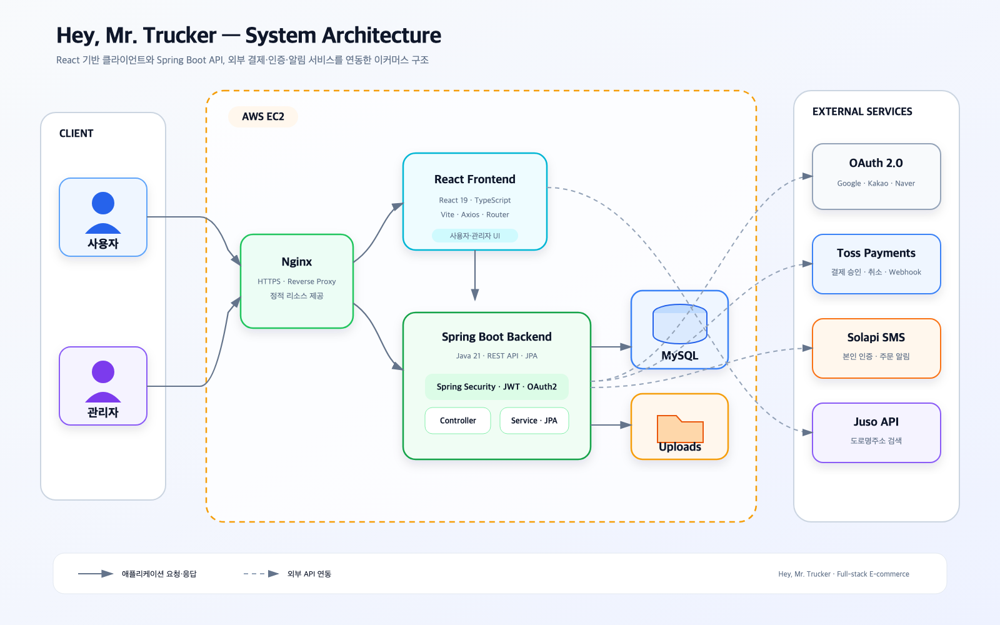
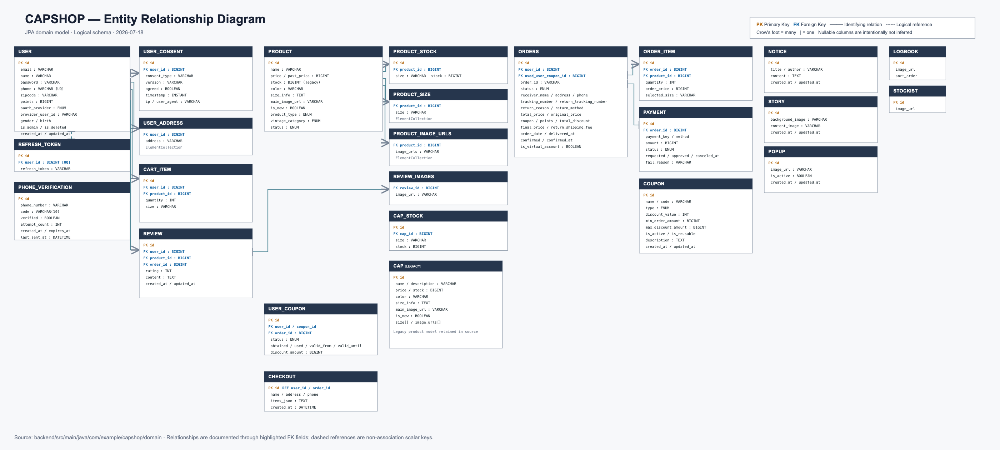

# Hey, Mr. Trucker

> 캡과 빈티지 아이템을 판매하는 개인 풀스택 이커머스 프로젝트  
> 상품 탐색부터 회원가입, 장바구니, 결제, 주문 관리까지 쇼핑몰의 전체 흐름을 구현했습니다.

---

## 프로젝트 소개

**Hey, Mr. Trucker**는 캡, 액세서리, 빈티지 상품을 판매하는 온라인 스토어입니다.

사용자는 상품을 조회하고 장바구니에 담아 결제할 수 있으며, 주문 내역·포인트·리뷰·배송지 등의 정보를 관리할 수 있습니다. 관리자는 상품, 주문, 쿠폰, 회원, 스토리, 팝업 콘텐츠를 통합 관리할 수 있습니다.

기획, 디자인, 프론트엔드, 백엔드, 데이터베이스 및 배포 환경을 모두 직접 구현한 개인 프로젝트입니다.

---

## 개발자

| Role | Developer |
|:---:|:---:|
| Full-stack Developer | [김찬호](https://github.com/nanchano0607) |

---

## 기술 스택

### Backend


### Frontend


### Database & Infrastructure


### External Services

- Google, Kakao, Naver OAuth 2.0
- Toss Payments
- Solapi SMS
- 도로명주소 검색 API

---

## 주요 기능

### 1. 회원 및 인증

- 일반 회원가입 및 로그인
- Google, Kakao, Naver 소셜 로그인
- JWT 기반 인증 및 Refresh Token 처리
- 휴대전화 본인 인증
- 아이디 찾기 및 비밀번호 재설정
- 보호된 페이지 접근 제어

### 2. 상품 및 쇼핑

- 캡, 액세서리, 빈티지 카테고리별 상품 조회
- 신상품 및 상품 상세 페이지
- 옵션·재고 기반 장바구니 관리
- 상품 이미지 및 상세 콘텐츠 관리
- 오프라인 판매처(Stockist) 안내

### 3. 주문 및 결제

- 배송지 입력 및 주문서 생성
- Toss Payments 결제 연동
- 결제 성공·실패 및 Webhook 처리
- 주문 내역과 상세 상태 조회
- 취소, 반품 및 환불 처리

### 4. 회원 혜택과 커뮤니티

- 쿠폰 발급 및 사용
- 주문 포인트 적립·조회
- 상품 리뷰 작성 및 통계
- Q&A 게시판
- 브랜드 스토리와 로그북

### 5. 관리자

- 상품 등록·수정 및 재고 관리
- 주문 상태·반품·환불 관리
- 회원, 쿠폰, 리뷰 및 게시글 관리
- 스토리와 사이트 팝업 관리

---

## 프로젝트 구조

```text
capshop/
├── backend/                    # Spring Boot REST API
│   ├── src/main/java/          # Controller, Service, Repository, Domain
│   └── src/main/resources/     # 애플리케이션 설정
├── frontend/                   # React + TypeScript 클라이언트
│   ├── src/components/
│   ├── src/layouts/
│   └── src/pages/
├── docs/                       # ERD 문서
└── uploads/                    # 런타임 업로드 파일(Git 제외)
```

---

## System Architecture & ERD

### System Architecture



### ERD



---

## 로컬 실행

### 요구 사항

- Java 21
- Node.js 20 이상
- MySQL 8

### Backend

예제 설정을 복사한 후 자신의 로컬 환경과 API 키를 입력합니다.

```bash
cp backend/src/main/resources/application-example.properties \
   backend/src/main/resources/application.properties

cd backend
./gradlew bootRun
```

실제 `application.properties`와 `application-prod.properties`는 보안을 위해 Git에서 제외됩니다.

### Frontend

`frontend/.env` 파일을 만들고 필요한 값을 설정합니다.

```properties
VITE_API_BASE_URL=http://localhost:8080
VITE_TOSS_CLIENT_KEY=
VITE_JUSO_API_KEY=
```

```bash
cd frontend
npm install
npm run dev
```

> OAuth, 결제, SMS 및 주소 검색 기능을 사용하려면 각 서비스에서 발급받은 키와 Redirect URI 설정이 필요합니다.

---

## 보안 및 비공개 리소스

다음 항목은 저장소에 포함하지 않습니다.

- 운영 및 로컬 애플리케이션 설정
- 환경변수와 외부 서비스 인증키
- 사이트 고유 이미지·영상 및 사용자 업로드 파일
- 주소 검색 키가 포함된 별도 HTML 파일

저장소의 `application-example.properties`에는 실행에 필요한 설정 항목만 예시로 제공합니다.

---

## Git Convention

- `✨ Feat`: 새로운 기능
- `🐛 Fix`: 버그 수정
- `🎨 Design`: UI 및 스타일 변경
- `♻️ Refactor`: 코드 리팩터링
- `🔧 Settings`: 설정 변경
- `📝 Docs`: 문서 변경
- `➕ Dependency`: 의존성 추가
- `🚀 Deploy`: 배포 작업
- `🔥 Remove`: 파일 또는 기능 제거
- `⏪ Revert`: 변경 사항 롤백

---

## License

이 프로젝트에서 김찬호가 직접 제작한 소스 코드와 디자인 자산의 저작권은 김찬호에게 있습니다. 사전 허가 없는 복제, 수정, 배포 및 상업적 이용을 금지합니다.
